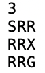
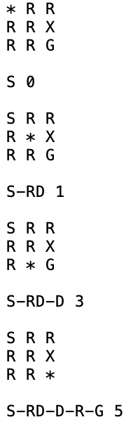

# A* Search Algorithm Python Implementation
 
 
### Purpose
The purpose of this project was to write a Python 3 program called pathfinder which finds a path from a given starting tile to a goal tile in a grid of size N x N which indicates a topographic map. This is the implementation of the A* search algorithm in Python.

### Task
The A* search algorithm was implemented to find the shortest path.

### Version 
12 May 2020 

### How to Start
* The folders "Input" and "Output" should be placed in the same folder as `pathfinder.py`.
* The input file should be placed in the folder "Input". 
* Run `pathfinder.py` from terminal by executing the following command.
 `python pathfinder.py <INPUT/input#.txt> <OUTPUT/output#.txt> <flag>`
 i.e. python pathfinder.py INPUT/input1.txt OUTPUT/output1.txt 0 
  * input#.txt : the name of the input file where # is the number 
  * output#.txt : the name of the output file where # is the number 
  * flag : the number of node expansions which require a diagnostic output

### Rules
* Cost of a diagonal move is 1, while other moves have a cost of 2.
* Allowed to go to one of eight surrouding tiles.
* Not allowed to move to a mountainous tile.
* Not allowed to move diagonally when one of the directions composing the diagonal has a mountainous tile.

### Input
* The first line has one number which indicates the number of rows and columns. 
* Following lines have the grid, one line for each row. 
  * S : Start
  * G : Goal
  * Normal : R
  * Mountain : X
* Input example: 
 &nbsp;&nbsp;

### Output
* The pathfinder program produces a sequence of moves, showing a path from the start node to the goal node, the accumulated cost, and the position after each move.
* Actions are written as below.
  * R : Right
  * RD: Diagonal Right-Down
  * D : Down
  * LD : Diagonal Left-Down
  * L : Left
  * LU : Diagonal Left-Up
  * U : Up
  * RU : Diagonal Right-Up
* Output example: 
 &nbsp;&nbsp;
